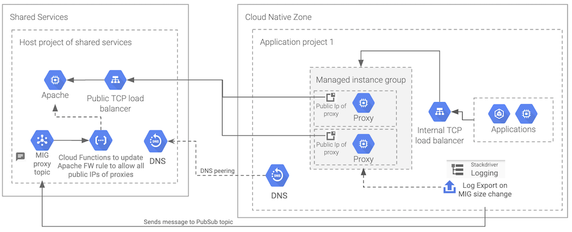

# Shared Services architecture

## Overview

The code in this repository implements a shared the service architecture depicted in the following diagram:

The system is composed of a **Shared Services** project that exposes a set of services to one or more applications called **Cloud Native Zones** (CNZ). The applications hosted in the CNZ projects will typically not have direct access to the internet. They will reach the shared services via an outgoing proxy that will be provided to them. The proxy will be able to autoscale, adding new instances to meet the demand from the CNZ applications.

On the other side, the Shared Services will expose the services via TCP or HTTP load balancers. These LBs will only accept incoming connections from the external IP addresses of the CNZ proxy instances. Since the number of proxy instances may vary depending on the CNZ load, the firewall rules need to be updated to refresh the list of external IP addresses of the proxies. This dynamic IP address filtering is implemented by a Cloud Function that refreshes the incoming firewall rules whenever a proxy instance is added or removed.

## Implementation

You will find here two different terraform implemantations of the architecture described above:

1. A [flat implementation](./terraform_flat) that does not use any terraform modules and relies only on the terraform resources from the [Google Cloud Platform Provider](https://www.terraform.io/docs/providers/google/index.html). This flat and verbose approach will allow us to explain each one of the architectire components in a series of Medium articles.
2. A [CFT based implementation](./terraform_cft), that relies on the [Cloud Foundation Toolkit modules](https://github.com/GoogleCloudPlatform/cloud-foundation-toolkit). This implementation is much more compact and streamlined, and serves as a real world example of how you can leverage CFT modules to simplify your GCP infrastructure deployments.

## Resources

**TODO**: Describe the GCP resources used in this architecture.

